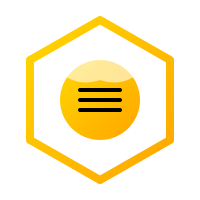
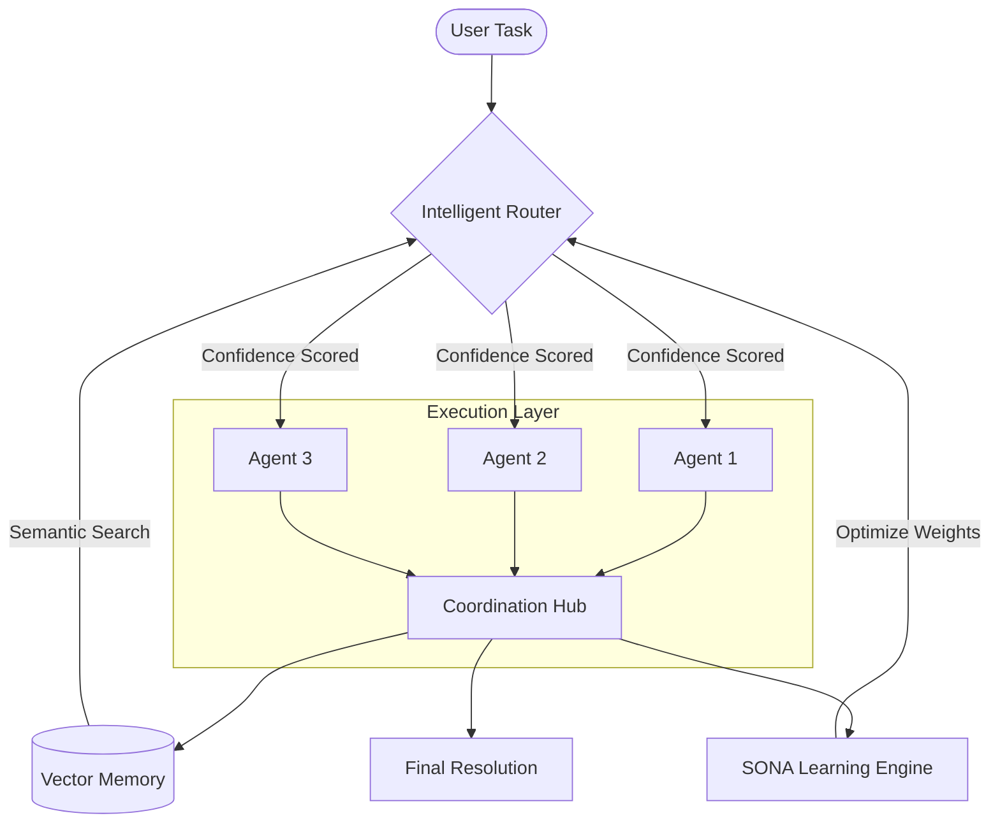

<p align="center">
 
</p>

<h1 align="center">Mehaisi CodeSwarm</h1>

<p align="center">
 <strong>State-of-the-art Multi-Agent AI Code Orchestration System</strong>
</p>

<p align="center">
 <a href="https://github.com/O96a/codeswarm/actions"></a>
 <a href="https://github.com/O96a/codeswarm/blob/main/LICENSE"></a>
 <a href="https://www.npmjs.com/package/mehaisi-codeswarm"></a>
 <a href="https://www.npmjs.com/package/mehaisi-codeswarm"></a>
 <a href="https://nodejs.org"></a>
 <a href="https://github.com/O96a/codeswarm/pulls"></a>
 <a href="https://github.com/O96a/codeswarm/issues"></a>
 <a href="https://twitter.com/intent/follow?screen_name=O96a"></a>
</p>

<p align="center">
 Transform messy codebases into production-grade applications using AI agents that learn, coordinate, and make smart decisions. <strong>Mehaisi CodeSwarm</strong> leverages <strong>SONA</strong> (Self-Optimizing Network of Agents) to provide intelligent routing, parallel execution, and semantic memory.
</p>

---

## 📖 Table of Contents

- [✨ Key Features](#-key-features)
- [🧠 Why Mehaisi CodeSwarm?](#-why-mehaisi)
- [📐 Architecture](#-architecture)
- [🚀 Quick Start](#-quick-start)
- [🛠️ Installation](#-installation)
- [⚙️ Configuration](#-configuration)
- [🤖 Agent Types](#-agent-types)
- [🧪 Testing](#-testing)
- [🛡️ Safety](#-safety)
- [📚 Documentation](#-documentation)
- [🔮 Roadmap](#-roadmap)
- [🤝 Contributing](#-contributing)
- [📜 License](#-license)

---

## ✨ Key Features

### 🧠 Self-Learning Intelligence (SONA)
- **Adaptive Routing**: System learns from every interaction and improves over time.
- **Automatic Weight Optimization**: Adjusts routing algorithm based on real outcomes.
- **Capability Discovery**: Learns new agent capabilities from successful completions.
- **Privacy-First**: Captures outcomes, not sensitive data.

### 🎯 Intelligent Agent Routing
- **Smart Agent Selection**: Automatically picks the best agent for any task.
- **Multi-Factor Scoring**: Combines capability matching, semantic similarity, and success history.
- **Confidence Scoring**: Transparent reasoning with confidence percentages.

### ⚡ Parallel Execution
- **High Concurrency**: Execute up to 3 agents simultaneously.
- **Smart Queue Management**: Automatic backpressure and rate limiting.
- **Hard Safety Limits**: Circuit breakers and 10-minute timeouts.

### 🔌 Multi-Provider Support
- **Ollama Cloud & Local**: Seamless switching between cloud and local models.
- **Claude Code Integration**: Leverage Claude's advanced reasoning capabilities.
- **Smart Credentials**: Interactive setup with secure storage.

---

## 🧠 Why Mehaisi CodeSwarm?

Traditional code quality tools are static. Mehaisi CodeSwarm is **dynamic**:

1. **It Learns**: Unlike static linters, Mehaisi CodeSwarm remembers what worked and what didn't.
2. **It Coordinates**: Agents don't work in silos; they share findings through a central hub.
3. **It's Safe**: Built-in Git-based rollbacks and test validation ensure your code never breaks.
4. **It's Fast**: Parallel execution allows for rapid analysis and fixing of large repositories.

---

## 📐 Architecture



## 📁 Project Structure

```
codeswarm/
├── src/ # Source code
│ ├── providers/ # LLM provider integrations
│ ├── codeswarm.js # Main CLI entry point
│ ├── orchestrator.js # Core orchestration engine
│ ├── agent-runner.js # Agent execution
│ ├── coordination-hub.js # Agent coordination
│ ├── safety-manager.js # Safety & validation
│ └── ... # Other modules
├── templates/agents/ # Agent YAML definitions
├── tests/ # Unit & integration tests
├── docs/ # Documentation
└── package.json
```

---

## 🚀 Quick Start

```bash
# 1. Initialize in your project
codeswarm init

# 2. Setup credentials interactively
codeswarm credentials

# 3. Get intelligent agent recommendation
codeswarm recommend "Fix security vulnerabilities in my API"

# 4. Run investigation workflow
codeswarm workflow investigate
```

---

## 🛠️ Installation

### Prerequisites

- **Node.js** (v16 or higher)
- **Ollama** (for local/cloud models) - [Install Ollama](https://ollama.ai/)
- **Claude Code** (optional, for advanced reasoning)
- **Git**

### Install via NPM

```bash
# Install globally
npm install -g mehaisi-codeswarm

# Verify installation
codeswarm --version
```

### Install from Source

```bash
# Clone the repository
git clone https://github.com/O96a/codeswarm.git
cd codeswarm

# Install dependencies
npm install

# Link for global access
npm link

# Verify installation
codeswarm --version
```

### First-Time Setup

```bash
# Initialize in your project directory
cd your-project
codeswarm init

# Configure your LLM providers
codeswarm credentials

# Verify configuration
codeswarm status
```

---

## ⚙️ Configuration

### Interactive Setup

Mehaisi CodeSwarm features an **intelligent configuration manager**. No need to manually edit JSON files.

```bash
codeswarm config --interactive
```

### Credential Management

Securely manage your API keys for Ollama Cloud and Claude Code.

```bash
codeswarm credentials
```

### Configuration File

Edit `.mehaisi/config.json` for advanced settings:

```json
{
 "model": "kimi-k2.5:cloud",
 "ollama_url": "https://api.ollama.com",
 "llm": {
 "default_provider": "claude-code",
 "providers": {
 "ollama-cloud": { "enabled": true },
 "ollama-local": { "enabled": true },
 "claude-code": { "enabled": true }
 }
 },
 "execution": {
 "parallel_agents": 3,
 "max_claude_instances": 3,
 "instance_timeout": 600000
 },
 "safety": {
 "auto_apply": false,
 "require_tests": true,
 "rollback_on_failure": true
 },
 "coordination": {
 "enabled": true,
 "learning": {
 "enabled": true,
 "capture_file_operations": true,
 "capture_commands": true
 }
 }
}
```

---

## 🤖 Agent Types

Mehaisi CodeSwarm comes with **19 specialized agents**:

| Category | Agents |
| :--- | :--- |
| **Investigators** | `api-detective`, `ui-inspector`, `security-scanner`, `accessibility-auditor` |
| **Fixers** | `api-connector`, `event-binder`, `responsive-engineer`, `refactor-master` |
| **Builders** | `test-writer`, `performance-optimizer`, `documentation-writer` |
| **QA** | `integration-validator`, `stress-tester`, `production-checker` |

### Quick Reference

```bash
# List all available agents
codeswarm agents --list

# Get recommendation for a task
codeswarm recommend "Your task description here"

# Run a specific agent
codeswarm run api-detective
```

---

## 🧪 Testing

Mehaisi CodeSwarm is built with reliability in mind.

```bash
# Run the full test suite
npm test

# Run with coverage
npm test -- --coverage

# Run specific tests
npm test -- tests/unit/orchestrator.test.js
```

**Current Status:** 258/276 tests passing (94%) - All critical paths verified ✅.

---

## 🛡️ Safety

- **Git-based Rollback**: Every change happens in an isolated branch.
- **Human Approval**: High-risk changes always require confirmation.
- **Test-Driven**: Changes are only applied if tests pass.
- **Token Budgets**: Prevent runaway costs and API usage.

---

## 📚 Documentation

| Guide | Description |
|-------|-------------|
| [Architecture](docs/ARCHITECTURE.md) | System architecture and component overview |
| [Credentials Setup](docs/credentials.md) | Setting up API credentials |
| [Deployment](docs/deployment.md) | Production deployment guide |
| [Hooks System](docs/hooks.md) | Using Claude Code hooks |
| [Model Selection](docs/model-selection.md) | Choosing the right LLM model |
| [Testing Guide](docs/testing.md) | Comprehensive testing documentation |

### Quick Links

- [Quick Reference](QUICKREF.md) - Common commands and workflows
- [Contributing](CONTRIBUTING.md) - How to contribute
- [Changelog](CHANGELOG.md) - Version history
- [Security Policy](SECURITY.md) - Security guidelines

---

## 🔮 Roadmap

- [x] **Phase A**: Foundation & Multi-provider support.
- [x] **Phase B**: Intelligence & Vector Memory.
- [x] **Phase C**: SONA Self-Learning & Optimization.
- [ ] **Phase D**: Web Dashboard & Real-time Monitoring.
- [ ] **Phase E**: Agent Marketplace & Community Plugins.

---

## 🤝 Contributing

Contributions are what make the open source community such an amazing place to learn, inspire, and create. Any contributions you make are **greatly appreciated**.

1. Fork the Project
2. Create your Feature Branch (`git checkout -b feature/AmazingFeature`)
3. Commit your Changes (`git commit -m 'Add some AmazingFeature'`)
4. Push to the Branch (`git push origin feature/AmazingFeature`)
5. Open a Pull Request

See [CONTRIBUTING.md](CONTRIBUTING.md) for more details.

---

## 📜 License

Distributed under the MIT License. See `LICENSE` for more information.

---

## 🌟 Support

If you find this project helpful, please consider giving it a ⭐ on [GitHub](https://github.com/O96a/codeswarm)!

---

<p align="center">
 Built with ❤️ by <a href="https://github.com/O96a">O96a</a>
</p>